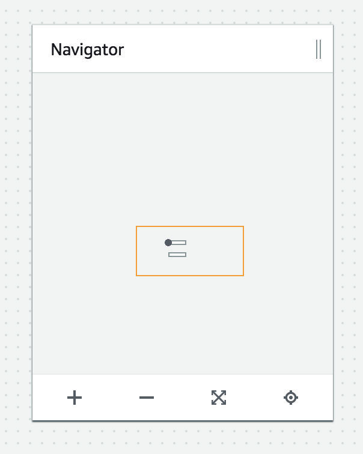

# Diagram Maker Minimap Plugin

[Diagram Maker Minimap Plugin](https://awslabs.github.io/diagram-maker-plugin-minimap) is a plugin to display a minimap for [Diagram Maker](https://github.com/awslabs/diagram-maker) to help in navigating large workspaces with lots of nodes & edges.

A mockup of how a panel might be rendered using the minimap plugin within the Diagram Maker editor.

## Explore

### Interactive Demo
Check out one of our interactive demos [here](https://awslabs.github.io/diagram-maker-plugin-minimap/examples/WideMinimap.html) or see the full list of interactive demos [here](https://awslabs.github.io/diagram-maker-plugin-minimap/explore/demos.html).

## How do I use it?

### Installation
Check out our installation guide [here](https://awslabs.github.io/diagram-maker-plugin-minimap/getting-started/install.html).

### Usage
Check out our usage guide [here](https://awslabs.github.io/diagram-maker-plugin-minimap/usage/integration.html).

## Docs
Check out our full documentation [here](https://awslabs.github.io/diagram-maker-plugin-minimap).

## Security

See [CONTRIBUTING](CONTRIBUTING.md#security-issue-notifications) for more information.

## License

This project is licensed under the Apache-2.0 License.

